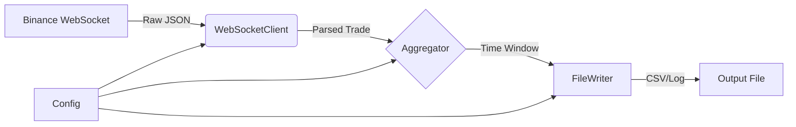

# CQG Test Task: Binance Market Data Service

## Overview

This repository contains a C++ project scaffold for a Binance market data service.

Current status:
- The project builds successfully with CMake.
- Configuration values are stored in [config/config.json](config/config.json).

## Architecture Overview

The diagram below reflects the intended service structure.



## Project Structure

```text
.
|- CMakeLists.txt
|- config/
|  \- config.json
|- src/
|  \- main.cpp
\- tests/
```

## Build

Example build from the project root:

```powershell
cmake -S . -B build
cmake --build build --config Debug
```

If you use a multi-config generator such as Visual Studio, the executable will be placed in the corresponding configuration subdirectory.

## Run

Example run command from the project root:

```powershell
.\build\binance_service.exe
```

Depending on the selected generator and configuration, the binary may also be located under a path such as `.\build\Debug\binance_service.exe`.

## Configuration

The project currently includes the following configuration file:

- [config/config.json](config/config.json)

Defined fields:

- `trading_pairs`
- `aggregation_window_ms`
- `serialization_interval_ms`
- `output_file`


## Testing

See `tests` directory exists.

